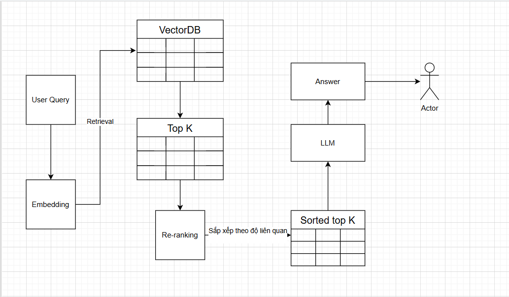

# 🧠 NeoRAG-Cup-2025

NeoRAG Cup 2025 là cuộc thi học thuật – kỹ thuật do Team AI – CLB Lập trình ProPTIT tổ chức, dành cho các bạn đam mê Trí tuệ nhân tạo (AI), Xử lý ngôn ngữ tự nhiên (NLP) và Kỹ thuật hệ thống.
Người tham gia sẽ:
Tự thiết kế, hiện thực hóa và trình bày một pipeline RAG (Retrieval-Augmented Generation) với domain là thông tin của CLB ProPTIT.
Trải nghiệm toàn bộ quy trình phát triển sản phẩm AI từ ý tưởng → triển khai → demo.

## 🏗️ Kiến trúc sử dụng
- Tên kiến trúc: NeoRAG-CE — ANN Retrieval + Cross-Encoder Reranking + LLM Generation
- Triết lý: tách lớp rõ ràng (Embeddings ⇢ Vector DB ⇢ Reranker ⇢ LLM), dễ cấu hình, dễ thay thế từng thành phần.

### 🔩 Sơ đồ kiến trúc (mermaid)


- Sử dụng mô hình 'gemini-embedding-001' để embedding query của user, sau đó truyền vector Eq(vector câu hỏi user) vào tiến hành retrieval tìm kiếm trong vectorDB(mongoDB), sử dụng VectorSearch sau đó trả về topK vector giống nhất.
- Sau đó lấy topK này vào re-ranking với model ViRanker để lấy ra topN đã được sắp xếp theo độ liên quan với Eq gốc, đưa vào LLM để nhận response và trả lại cho người dùng

### 🧩 Thành phần chính
- `embeddings.py`: bộ mã hoá (Gemini, OpenAI, Sentence-Transformers)
- `vector_db.py`: trừu tượng hoá Vector DB (MongoDB, ChromaDB, Qdrant, Supabase)
- `reranker.py`: Cross-Encoder reranking (FlagEmbedding – ViRanker)
- `metrics_rag.py`: tập hợp các metrics cho Retrieval và LLM Answer
- `app.py`: ứng dụng Streamlit demo RAG, hỗ trợ streaming

## ✨ Điểm nổi bật
- Modular & pluggable: dễ thay thế nhà cung cấp embedding/LLM/Vector DB
- Auto reranking: cải thiện độ chính xác context trước khi sinh câu trả lời
- Streamlit demo mượt: chat UI có streaming, lịch sử top→bottom
- Bộ metrics đa dạng: Retrieval (Hit@k/MAP/MRR/NDCG) và LLM Answer (Rouge-L/BLEU-4/Groundedness/...)
- Cache nội bộ cho embedding và rerank nhằm tiết kiệm chi phí/lượt gọi
- Kết quả tìm câu trả lời đúng khá tốt(các hàm hit_k, recall_k, precision_k, ... trả về kết quả khá ổn)

## ⚠️ Hạn chế
- Phụ thuộc API khoá ngoài (OpenAI, Gemini), giới hạn RPM, RPD
- Một số đánh giá LLM-judged nhạy cảm định dạng đầu ra mô hình
- Thời gian chạy có thể tăng khi rerank và gọi nhiều API
- Chất lượng phụ thuộc dữ liệu index và chiến lược tiền xử lý
- Tỷ lệ thông tin đúng trong top_k khá thấp(các hàm context không cao lắm)

## 📊 Benchmark (2 tập dữ liệu)

### Retrieval – Train (10 query)(chưa update)
| K  | hit@k | recall@k | precision@k | f1@k | map@k | mrr@k | ndcg@k | context_precision@k | context_recall@k | context_entities_recall@k |
|----|-------|----------|-------------|------|-------|-------|--------|----------------------|------------------|---------------------------|
| 3  | 0.31  | 0.19     | 0.12        | 0.15 | 0.23  | 0.23  | 0.25   | 0.63                 | 0.50             | 0.32                      |
| 5  | 0.46  | 0.28     | 0.10        | 0.15 | 0.23  | 0.27  | 0.31   | 0.56                 | 0.44             | 0.37                      |
| 7  | 0.57  | 0.35     | 0.09        | 0.15 | 0.23  | 0.28  | 0.35   | 0.54                 | 0.40             | 0.38                      |

### LLM Answer – Train (10 query)
| K  | string_presence@k | rouge_l@k | bleu_4@k | groundedness@k | response_relevancy@k | noise_sensitivity@k |
|----|-------------------|-----------|----------|----------------|----------------------|---------------------|
| 3  | 0.67              | 0.46      | 0.18     | 0.97           | 0.87                 | 0.43                |
| 5  | 0.56             | 0.40      | 0.17     | 1.00           | 0.88                 | 0.26                |
| 7  | 0.60              | 0.44      | 0.12     | 1.00           | 0.87                 | 0.77                |

### Retrieval – Test (30 query)
| K  | hit@k | recall@k | precision@k | f1@k | map@k | mrr@k | ndcg@k | context_precision@k | context_recall@k | context_entities_recall@k |
|----|-------|----------|-------------|------|-------|-------|--------|----------------------|------------------|---------------------------|
| 3  | 0.83  | 0.69     | 0.43        | 0.53 | 0.80  | 0.81  | 0.81   | 0.72                 | 0.02             | 0.03                      |
| 5  | 0.93  | 0.80     | 0.32        | 0.46 | 0.84  | 0.85  | 0.86   | 0.03                 | 0.05             | 0.05                      |
| 7  | 0.93  | 0.82     | 0.24        | 0.37 | 0.83  | 0.85  | 0.86   | 0.02                 | 0.04             | 0.01                      |

### LLM Answer – Test (30 query)
| K  | string_presence@k | rouge_l@k | bleu_4@k | groundedness@k | response_relevancy@k | noise_sensitivity@k |
|----|-------------------|-----------|----------|----------------|----------------------|---------------------|
| 3  | 0.32              | 0.36      | 0.16     | 0.44           | 0.80                 | 0.21                |
| 5  | 0.40              | 0.45      | 0.17     | 0.37           | 0.78                 | 0.12                |
| 7  | 0.36              | 0.41      | 0.02     | 0.21           | 0.21                 | 0.18                |

## 🚀 Chạy demo

Yêu cầu Python 3.10+ và các khoá API tương ứng:
- `OPENAI_API_KEY` cho OpenAI
- `GEMINI_API_KEY` cho Gemini
- `MONGODB_URI`

Cài đặt phụ thuộc:
```bash
pip install -r requirements.txt
```

Chạy demo Streamlit (giao diện chat có streaming):
```bash
streamlit run app.py
```

Hoặc có thể truy cập trang đã được deploy tại đây:(Hãy chuyển về light mode)
## ⚙️ Cấu hình nhanh
- Chọn nhà cung cấp Embedding: `gemini`
- Vector DB: `mongodb` 
- Reranker: mặc định `namdp-ptit/ViRanker` (FlagEmbedding)
- LLM sinh câu trả lời: `gemini` / `openai`

## 📁 Cấu trúc dự án (rút gọn)
```
NeoRAG-Cup-2025/
├─ embeddings.py        # Bộ mã hoá văn bản (Gemini/OpenAI/SBERT)
├─ vector_db.py         # Trừu tượng hoá Vector DB (MongoDB/Chroma/Qdrant/...)
├─ reranker.py          # Cross-Encoder reranker (ViRanker)
├─ metrics_rag.py       # Bộ metrics đánh giá Retrieval/LLM Answer
├─ app.py               # Streamlit demo (chat + streaming + auto-rerank)
├─ neo_rag_chat.py      # Streamlit app mới, UI gọn, lịch sử top→bottom
├─ agent.py             # Agent tích hợp tìm kiếm context
├─ requirements.txt     # Phụ thuộc Python
└─ Img/logo Pro_2.png   # Ảnh minh hoạ/cover
```

---


